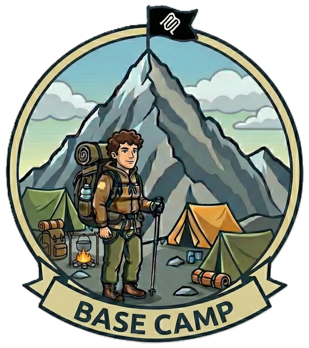
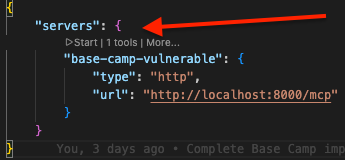
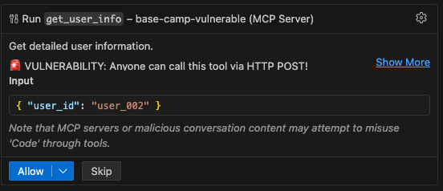

---
hide:
  - toc
---

# Base Camp: Understanding the Mountain

*Know Your Terrain Before You Climb*



Welcome to **Base Camp**, the foundation of your MCP security journey. Before we ascend to the higher camps where we'll tackle production-grade security patterns, we need to establish a solid foundation. Just as mountaineers acclimatize at base camp before attempting the summit, you'll start here by understanding what MCP is, why it needs security, and experiencing firsthand what happens when security is absent.

This camp introduces you to the **"vulnerable → exploit → fix → validate"** methodology that you'll use throughout the entire workshop series. You'll run an intentionally vulnerable MCP server, exploit it to see the real-world impact, implement a basic security fix, and validate that the fix works. By the end of Base Camp, you'll have hands-on experience with MCP security fundamentals and be ready for the advanced patterns in the camps ahead.

**Tech Stack:** Python, FastMCP, VS Code  
**Primary Risks:** [MCP01](https://microsoft.github.io/mcp-azure-security-guide/mcp/mcp01-token-mismanagement/) (Token Mismanagement & Secret Exposure), [MCP07](https://microsoft.github.io/mcp-azure-security-guide/mcp/mcp07-authz/) (Insufficient Authentication & Authorization)

## What is the Model Context Protocol (MCP)?

The **Model Context Protocol (MCP)** is an open standard for connecting AI applications to data sources and tools. It provides a common communication protocol so any AI system can work with any data source, without requiring custom integrations for each combination.

**Why does this matter for security?** Because MCP servers often expose sensitive operations, such as reading user data, executing commands, and accessing internal systems. If these servers lack proper authentication and authorization, anyone who can connect to them can access everything they expose.

!!! info "Learn More"
    For a comprehensive introduction to MCP, see the [OWASP MCP Azure Security Guide](https://microsoft.github.io/mcp-azure-security-guide/#what-is-the-model-context-protocol-mcp)

### MCP Architecture

At its core, MCP connects AI applications (like VS Code or Claude Desktop) to data sources and tools (like databases, APIs, and file systems). The protocol sits in the middle, enabling bidirectional communication so AI applications can discover capabilities and invoke them on demand.

```
┌─────────────────────┐                              ┌─────────────────────┐
│                     │                              │                     │
│  AI Applications    │        ┌─────────────┐       │  Data Sources       │
│                     │        │             │       │  and Tools          │
│  • Claude Desktop   │◄──────►│     MCP     │◄─────►│                     │
│  • VS Code          │        │             │       │  • Databases        │
│  • Custom AI Agents │        │ Standardized│       │  • APIs             │
│  • ChatGPT          │        │  Protocol   │       │  • File Systems     │
│                     │        │             │       │  • Dev Tools        │
│                     │        └─────────────┘       │                     │
└─────────────────────┘                              └─────────────────────┘
     (Hosts/Clients)          Bidirectional                (MCP Servers)
                               Data Flow
```

In this workshop, you'll work with both sides of this architecture to understand where security risks emerge and how to address them.

- **Left side (AI Applications):** VS Code, and other applications, act as the MCP client, connecting to MCP servers
- **Right side (MCP Servers):** We'll run both vulnerable and secure servers that expose user data
- **The Risk:** If the MCP server (right side) has no authentication, any client can connect and access all data

---

## Prerequisites

Before starting Base Camp, ensure you have the required tools installed.

!!! info "📋 Prerequisites Guide"
    See the **[Prerequisites page](../prerequisites.md)** for detailed installation instructions and troubleshooting.

**Quick checklist for Base Camp:**

- Python 3.10+
- uv (Python package installer)
- VS Code with GitHub Copilot (recommended for exploitation scenarios)

**Verify your setup:**
```bash
python --version && uv --version
```

---

### Clone the Workshop Repository

```bash
git clone https://github.com/Azure-Samples/sherpa.git
cd sherpa
```

### Setup Python Environment for Base Camp

```bash
# Navigate to Base Camp
cd camps/base-camp

# Install uv if not already installed
curl -LsSf https://astral.sh/uv/install.sh | sh

# One command setup (creates venv, installs all dependencies)
uv sync
```

!!! tip "Architecture Note"
    Each camp uses a single shared `.venv` for all components (vulnerable server, secure server, exploits). This simplifies setup for workshop participants.

---

## The Ascent

Now it's time to begin your climb. Each waypoint below builds on the previous one, guiding you from vulnerability discovery to validated security fixes. You'll experience MCP security vulnerabilities firsthand, understand their impact, implement fixes, and verify your solutions work.

Click any waypoint below to expand its instructions and continue your ascent.

??? note "Waypoint 1: Run Vulnerable Server"

    ### Start the Vulnerable MCP Server

    ```bash
    # Run the server
    cd vulnerable-server
    uv run --project .. python -m src.server
    ```

    You should see:

    ```
    🏔️  Base Camp - Vulnerable MCP Server (Streamable HTTP)
    ======================================================================
    Server Name: Base Camp Vulnerable Server
    Available Resources: 3 user records
    Listening on: http://0.0.0.0:8000

    ⚠️  WARNING: This server has NO AUTHENTICATION!
       Anyone on the network can access ANY user's sensitive data via HTTP.

    🚨 OWASP MCP07: Insufficient Authentication & Authorization
    🚨 OWASP MCP01: Token Mismanagement & Secret Exposure
    ======================================================================
    ```

    The server is now running and ready to be exploited. Proceed to Waypoint 2 to test the vulnerability.

??? danger "Waypoint 2: Exploit the Vulnerability"

    ### Choose Your Exploitation Method

    All three methods below demonstrate the same vulnerabilities: **OWASP MCP07 (Insufficient Authentication & Authorization)** and **MCP01 (Token Mismanagement & Secret Exposure)**. Choose the approach that matches your learning style, or try multiple methods to see the vulnerability from different perspectives.

    !!! tip "Choose Your Path"
        **Quick & Comprehensive** - Automated Test Script  
        Perfect for: Seeing all exploits at once, understanding the full scope quickly
        
        **Visual & Interactive** - MCP Inspector  
        Perfect for: Hands-on exploration, understanding MCP protocol messages
        
        **AI-Powered Attack** - VS Code with GitHub Copilot  
        Perfect for: Real-world AI agent scenario, seeing how AI assistants can exploit vulnerabilities

    ---

    ??? example "Method 1: Automated Test Script"

        **Best for:** Developers who want to see comprehensive test results quickly

        Run the provided exploit script to demonstrate all vulnerabilities:

        ```bash
        cd camps/base-camp/exploits
        uv run --project .. python test_vulnerable.py
        ```

        This automated script uses **FastMCP Client** to perform 6 comprehensive exploit tests:

        1. :white_check_mark: **Enumerate Tools** - Connect without authentication and list available tools
        2. :warning: **Attempt Resource Enumeration** - Try to list resources (server doesn't expose list, but resources ARE accessible)
        3. :fire: **EXPLOIT** - Access user_001 (Alice Johnson) data without authentication
        4. :fire: **EXPLOIT** - Access user_002 (Bob Smith) data without authorization
        5. :fire: **EXPLOIT** - Access user_003 (Carol Williams) data without authorization
        6. :fire: **EXPLOIT** - Read resources directly via user:// URIs

        ??? danger "Security Impact"
            The script demonstrates:
            
            - No authentication required to connect
            - No authorization checks on tool calls
            - Complete data breach of all user accounts
            - Access to sensitive data (SSN, balance, email)
            - **Key point:** Even accessing user_001 is a breach because there's no identity verification!

        **Result:** All 6 exploits succeed, confirming OWASP MCP07 and MCP01 vulnerabilities!

    ??? example "Method 2: MCP Inspector"

        **Best for:** Visual learners who want to explore interactively

        Launch the MCP Inspector web interface:

        ```bash
        cd camps/base-camp/exploits
        ./launch-inspector-http.sh
        ```

        This opens a browser with an interactive MCP testing interface. Perfect for:

        - Visual exploration of resources
        - Interactive tool calling
        - Understanding MCP protocol messages
        - No code required!

        ### Step-by-Step Exploitation

        1. **Set the server URL:** In the MCP Inspector interface, enter `http://127.0.0.1:8000/mcp` (or `http://localhost:8000/mcp`)
        2. **Select transport type:** Choose **"Streamable HTTP"** from the transport dropdown
        3. **Click "Connect"** - Notice: No authentication required! ⚠️
        4. **Open Tools menu:** Click "Tools" in the menu bar to see available tools
        5. **Call the tool:** Select `get_user_info` and provide a `user_id` parameter

        ### Test: Access User Data

        Call the `get_user_info` tool with `user_id: "user_002"`:

        ```json
        {
          "name": "Bob Smith",
          "email": "bob@example.com",
          "ssn_last4": "5678",
          "account_balance": "$8,500.00"
        }
        ```

        ??? danger "Security Breach"
            You successfully retrieved sensitive user data without providing any credentials. This demonstrates how easily unsecured MCP servers can be exploited.
            
        **Try more exploits:**

        - Access different users: `user_001`, `user_002`, `user_003`
        - Notice: Everything is accessible without proving who you are!

    ??? example "Method 3: VS Code with GitHub Copilot Agent"

        **Best for:** Understanding real-world AI agent exploitation scenarios

        Use VS Code's built-in MCP support to see how an AI agent can exploit the vulnerability:

        ### Step 1: Configure the MCP Server

        The repository includes `.vscode/mcp.json` which is already configured to connect to the vulnerable server at `http://localhost:8000/mcp`.

        ### Step 2: Connect to the Server

        1. Open this repository in VS Code
        2. Make sure the vulnerable server is running (from Waypoint 1)
        3. Open the `.vscode/mcp.json` file
        4. Look for the **"Start"** button that appears above the `base-camp-vulnerable` server configuration
        5. Click **Start** to connect to the server

        

        Once connected, you'll see the server status change and the number of tools discovered listed.

        ### Step 3: Switch to Agent Mode

        Open the chat dialog and select **"Agent"** mode along with a model like **Claude Sonnet 4.5**.

        ### Step 4: Exploit via Agent Prompt

        In the Copilot Agent chat, enter this prompt:

        ```
        #base-camp-vulnerable get info for user_002
        ```

        The agent will automatically:

        - Discover the available tool
        - Call `get_user_info` with `user_id: "user_002"`
        - Display Bob Smith's sensitive data without any authentication

        !!! info "Permission Prompt"
            You may be prompted to allow the tool execution. Click **"Allow"** to proceed.
            
            

        **Try more exploits via Agent mode using these prompts:**

        - ```Get information for user_001 from base-camp-vulnerable```
        - ```Use base-camp-vulnerable to show me user_003's data```

    ---

??? warning "Waypoint 3: Understand the Risk"

    ### What Just Happened?

    You successfully exploited **OWASP MCP07 (Insufficient Authentication & Authorization)** and **MCP01 (Token Mismanagement & Secret Exposure)**.

    !!! danger "The Vulnerability"
        - The MCP server has NO authentication mechanism
        - ANY client can connect and access ANY resource
        - There's no code checking WHO is making the request
        - Both the resource handler and tool are completely open
        - Any client that can reach the server can call these functions with any `user_id` and retrieve sensitive data

    ### Real-World Impact

    | Impact Area | Consequence |
    |------------|-------------|
    | **Data Breach** | Unauthorized access to sensitive user information |
    | **Compliance** | GDPR, HIPAA, PCI-DSS violations |
    | **Reputation** | Customer trust destroyed |
    | **Financial** | Fines, legal fees, remediation costs |

    ### Code Review: Where's the Vulnerability?

    Let's examine the vulnerable code to understand exactly what went wrong.

    **File:** `vulnerable-server/src/server.py`
    
    ```python
    #VULNERABILITY: No authentication check!
    @mcp.resource("user://{user_id}")
    async def get_user_resource(user_id: str) -> str:
        """
        🚨 VULNERABILITY: No authentication check!
        Anyone on the network can access this HTTP endpoint
        and retrieve any user's sensitive data.
        """
        user = USERS.get(user_id)
        if not user:
            raise ValueError(f"User {user_id} not found")
        
        return f"""Name: {user['name']}
    Email: {user['email']}
    SSN: ***-**-{user['ssn_last4']}
    Balance: ${user['balance']:,.2f}

    ⚠️  WARNING: This data was accessed without authentication via HTTP!"""
    ```

??? success "Waypoint 4: Implement Security"

    ### Switch to Secure Server

    ```bash
    # Stop the vulnerable server (Ctrl+C)
    # Navigate to secure server
    cd ../secure-server
    ```

    ### Configure Authentication Token

    ```bash
    # Copy example environment file
    cp .env.example .env

    # The default token is: workshop_demo_token_12345
    # You can customize it by editing .env if desired
    ```

    ### Start the Secure Server

    ```bash
    # From camps/base-camp/secure-server directory
    uv run --project .. python -m src.server
    ```

    You should see:

    ```
    🏔️  Base Camp - Secure MCP Server (Streamable HTTP)
    ======================================================================
    Server Name: Base Camp Secure Server
    Available Resources: 3 user records
    Listening on: http://0.0.0.0:8001

    ✅ AUTHENTICATION ENABLED
       Required token: workshop_demo_token_12345
       All requests must include valid Bearer token

    ✅ AUTHORIZATION ENABLED
       Users can only access their own data (user_001)
    ======================================================================
    ```

    ### Test With MCP Inspector

    1. Open MCP Inspector in a new terminal: `npx @modelcontextprotocol/inspector`
    2. In the MCP Inspector web interface, change the server URL to `http://localhost:8001/mcp`
    3. Click "Connect" - you should get an authentication error (401 Unauthorized)
    4. Add the authentication header:

        - Click to add a custom header
        - **Header Name:** `Authorization`
        - **Header Value:** `Bearer workshop_demo_token_12345`
        - **Important:** Enable the toggle button to the left of the header!

    5. Click "Connect" again - now it succeeds!

    !!! success "Test the Security"
        Use the **Tools** menu in MCP Inspector to test authorization:
        
        :white_check_mark: Call `get_user_info` tool with `user_id: user_001` - should work (your own data)  
        :x: Call `get_user_info` tool with `user_id: user_002` - should fail (403 Forbidden)  
        :x: Call `get_user_info` tool with `user_id: user_003` - should fail (403 Forbidden)  

??? check "Waypoint 5: Validate the Fix"

    ### Automated Testing

    Run the secure server test script:

    ```bash
    cd camps/base-camp/exploits
    uv run --project .. python test_secure.py
    ```

    The test script uses **FastMCP Client** (`fastmcp.client.Client`) with **BearerAuth** to programmatically test the secure server.

    The script validates:

    :material-check: Test 1: Connection WITH token succeeds (user_001 can access own data)  
    :material-check: Test 2: Connection WITHOUT token fails (401 Unauthorized)  
    :material-check: Test 3: Invalid token is rejected (401 Unauthorized)  
    :material-check: Test 4: Authorization prevents accessing other user's data (user_002, user_003)  
    :material-check: Test 5: Resource access requires authentication. 

    Expected output when all tests pass:

    ```
    ======================================================================
      📊 SECURITY TEST SUMMARY
    ======================================================================

    Tests Passed: 5/5

    🎉 SUCCESS! All security fixes validated!

    🔒 Security Improvements Confirmed:
       ✅ Authentication - Bearer token required for all API access
       ✅ Authorization - Users can only access their own data
       ✅ Token Validation - Invalid tokens are rejected
       ✅ Unauthenticated Access - Blocked by default
       ✅ Resource Protection - Authentication required for all resources
    ======================================================================
    ```

    ### Code Review: How Was It Fixed?

    Open `secure-server/src/server.py` and examine the key changes:

    #### 1. FastMCP Built-in Authentication

    ```python
    from fastmcp.auth import StaticTokenVerifier

    # Define authentication using FastMCP's built-in verifier
    auth = StaticTokenVerifier(
        tokens={
            REQUIRED_TOKEN: {
                "client_id": "user_001",
                "scopes": ["read", "write"]
            }
        }
    )

    # Create MCP server with authentication enabled
    mcp = FastMCP("Base Camp Secure Server", auth=auth)
    ```

    #### 2. Authorization Helper Function

    ```python
    def check_authorization(requested_user_id: str, authenticated_user: str) -> bool:
        """Verify user can only access their own data"""
        return requested_user_id == authenticated_user
    ```

    #### 3. Secure Tool with Context

    ```python
    @mcp.tool()
    async def get_user_info(ctx: Context, user_id: str) -> dict:
        """Get detailed user information - NOW WITH SECURITY!"""
        # Get authenticated user from context
        authenticated_user = get_authenticated_user(ctx)
        
        # ✅ Authorization check
        if not check_authorization(user_id, authenticated_user):
            raise PermissionError(
                f"Forbidden: You are authenticated as {authenticated_user} but "
                f"cannot access {user_id}'s data."
            )
        
        user = USERS.get(user_id)
        if not user:
            raise ValueError(f"User {user_id} not found")
        
        return {
            "user_id": user_id,
            "name": user["name"],
            "email": user["email"],
            "ssn_last4": user["ssn_last4"],
            "balance": user["balance"],
            "authenticated_as": authenticated_user,
            "authorization_verified": True
        }
    ```

    #### 4. Streamable HTTP Transport

    ```python
    # Export HTTP app with streamable HTTP transport
    app = mcp.http_app(path="/mcp", transport="streamable-http")
    ```

    !!! check "Key Security Features"
        **Token-based authentication** - FastMCP's StaticTokenVerifier validates Bearer tokens  
        **Context injection** - Authenticated user info available in `Context` parameter  
        **Authorization checks** - Every tool validates user can access requested data  
        **Streamable HTTP** - Modern MCP transport protocol  

    ### ⚠️ Important: This Is NOT Production-Ready!

    While this fixes the Base Camp vulnerability, **do not use this approach in production**:

    !!! warning "Demo Limitations"
        **Simple bearer token** - No expiration, no rotation  
        **Token in environment variable** - Can leak in logs/errors  
        **Hardcoded user mapping** - Token directly maps to user_001 for demo purposes  
        **No token refresh** - Can't revoke access easily  
        **No audit logging** - Can't track access  
        **No rate limiting** - Vulnerable to brute force  

    !!! info "Why FastMCP's StaticTokenVerifier?"
        FastMCP provides built-in authentication for learning and prototyping. The StaticTokenVerifier is intentionally simple - it maps predefined tokens to user identities. This is perfect for understanding authentication concepts, but production systems need dynamic token validation (JWT), token rotation, and integration with identity providers.

    ### What Makes It Production-Ready? → Camp 1!

    In **Camp 1: Identity & Access Management**, you'll implement:

    :material-check: **OAuth 2.1 with PKCE** - Industry-standard authentication  
    :material-check: **Azure Entra ID** - Enterprise identity provider  
    :material-check: **Azure Managed Identity** - Passwordless authentication  
    :material-check: **Azure Key Vault** - Secure secrets storage (no .env files!)  
    :material-check: **JWT tokens** - With expiration, refresh, and validation  
    :material-check: **RBAC** - Role-based access control for fine-grained permissions  
    :material-check: **Audit logging** - Track every access for compliance  

## Summary & Key Takeaways

!!! success "What You've Learned"
    **Vulnerability Demonstrated:** Unauthenticated MCP servers expose all data  
    **OWASP Risk:** MCP07 - Insufficient Authentication & Authorization  
    **Fix Applied:** Token-based authentication on every request  
    **Pattern Learned:** The "vulnerable → exploit → fix → validate" methodology

### What's Next in Camp 1?

Base Camp used simple bearer tokens for demonstration. **Camp 1: Identity & Access Management** will upgrade to production-grade security:

- **OAuth 2.1** with PKCE (S256 method)
- **Azure Managed Identity** for passwordless authentication
- **Azure Key Vault** for secrets management
- **RBAC** for least-privilege access control

Then **Camp 2: Gateway & Network Security** will add centralized API/MCP Gateway protection with Azure API Management.

---

## Additional Resources

!!! tip "Learn More"
    **Source Code:** All code is available in the [GitHub repository](https://github.com/Azure-Samples/sherpa/tree/main/camps/base-camp)
    
    **OWASP Guide References:**
    
    - [MCP01: Token Mismanagement & Secret Exposure](https://microsoft.github.io/mcp-azure-security-guide/mcp/mcp01-token-mismanagement/)
    - [MCP07: Insufficient Authentication & Authorization](https://microsoft.github.io/mcp-azure-security-guide/mcp/mcp07-authz/)

---

**Ready to continue the ascent?** Head to [Camp 1: Identity & Access Management](camp1-identity.md) →

*Base Camp complete! You've learned the fundamentals. Now let's climb higher.* 🏔️
