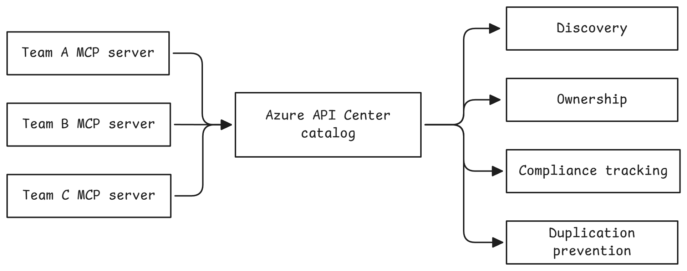

<div class="camp-banner">
  <div class="camp-banner-content">
    <div class="camp-banner-text">
      <div class="camp-banner-label">Camp 2 · Registry</div>
      <h1>API and MCP Governance</h1>
      <p>Discover shadow MCP servers, enforce standards, and centralize API governance with Azure API Center.</p>
    </div>
    <div class="camp-banner-image">
      <span class="banner-icon"><span class="material-icons">hub</span></span>
    </div>
  </div>
</div>

??? info "What is API Center?"
    **API Center** provides a centralized catalog for all your APIs and MCP servers:

    - **Native MCP Support** - API Center recognizes MCP as a first-class API type alongside REST, GraphQL, and gRPC
    - **Governed Registration** - Establish an approved inventory for MCP servers
    - **Discovery** - Search for MCP servers through the portal, MCP Registry, and private tool catalogs
    - **Documentation** - Links to MCP tool definitions and usage guides
    - **Versioning** - Track MCP server versions and deprecation schedules
    - **Ownership** - See who owns each MCP server and how to contact them
    - **Compliance** - Tag MCP servers with compliance requirements (HIPAA, PCI, etc.)

    Think of it like a library catalog, but for APIs and MCP servers. Registration
    makes approved servers discoverable; your deployment process still needs to
    enforce the rule that unregistered servers aren't promoted.

## The Security Challenge: Shadow MCP Servers & API Sprawl

**OWASP Risks:** [MCP09 (Shadow MCP Servers)](https://microsoft.github.io/mcp-azure-security-guide/mcp/mcp09-shadow-servers/) (primary), with secondary mitigation of [MCP03 (Tool Poisoning)](https://microsoft.github.io/mcp-azure-security-guide/mcp/mcp03-tool-poisoning/) — a curated registry blocks unknown or poisoned tools from being discovered and invoked.

As your organization grows, teams independently deploy MCP servers, creating dangerous blind spots:

- **Shadow MCP servers** - Teams deploy unauthorized servers without security review
- **Discovery problem** - Security team doesn't know what MCP servers exist
- **Documentation scattered** - Each team maintains their own docs
- **Duplicate servers** - Two teams build the same MCP tools
- **No ownership tracking** - Who maintains the weather MCP server?
- **Compliance blind spots** - Can't prove all MCP servers meet security standards
- **Unvetted access** - Shadow servers may expose sensitive data without proper controls

You need **centralized API governance** to identify approved MCP servers and make
shadow deployments easier to detect.

{ .center width=720 }

---

## Waypoint 1.4: Register MCP Servers in API Center

Register your MCP servers in Azure API Center:

=== "Bash"
    ```bash
    ./scripts/1.4-fix.sh
    ```

=== "PowerShell"
    ```powershell
    ./scripts/1.4-fix.ps1
    ```

This registers only the two MCP endpoints—not the backing Trails REST API:

- **Sherpa MCP Server** - Weather, trails, and gear recommendations
- **Trails MCP Server** - Trail information and permit management

For each server, the script creates:

- A version marked **Preview**
- A Streamable HTTP definition
- An active deployment containing the APIM runtime URL
- Use cases, repository, support, and workshop documentation
- Authentication and non-production security metadata
- An association with the shared Camp 2 APIM environment

The script also assigns the signed-in participant the **Azure API Center Data
Reader** role. This camp does not deploy Microsoft Foundry, but the role means the
registry could later be discovered as a private tool catalog from a Foundry project
if you choose to add one.

!!! warning "Credentials are not stored in API Center"
    The registry describes the required authentication but does not store credentials:

    - **Sherpa MCP:** Microsoft Entra OAuth
    - **Trails MCP:** Microsoft Entra OAuth and an `Ocp-Apim-Subscription-Key` header

    Consumers configure these credentials when they add the tool. Configuring
    API Center authorization and portal test-console access is intentionally
    deferred to a later enhancement.

### Verify the API Center inventory

After running the script, open the Azure portal link printed by the script and
select **Inventory** > **Assets**:

| Name | Type | Version lifecycle | Environment |
|------|------|-------------------|-------------|
| Sherpa MCP Server | MCP | Preview | Camp 2 APIM Gateway |
| Trails MCP Server | MCP | Preview | Camp 2 APIM Gateway |

!!! tip "MCP is a First-Class API Type"
    Notice that API Center lists **MCP** as the API type, not REST or GraphQL. Azure API Center natively understands MCP servers, making it easy to discover and govern all your AI tool integrations in one place.

---

## What You Just Fixed

**Before (no governance):**

- No authoritative list of approved MCP servers
- No visibility into what MCP servers exist
- Duplicate implementations across teams
- No compliance tracking
- Can't enforce security standards

**After (API Center):**

- Approved MCP servers registered in a central catalog
- Unregistered servers are easier to identify as shadow deployments
- Easy discovery prevents duplicate work
- Versions, deployments, support, and security requirements are visible
- The registry is ready to surface as a private tool catalog in Microsoft Foundry if you add one later

This provides a governance control for **OWASP MCP09 (Shadow MCP Servers)** and
supports **MCP03 (Tool Poisoning)** defenses by giving consumers an approved,
metadata-rich registry. Enforcement still depends on organizational deployment
and access policies.

---

## Going Further: API Center Portal and Tool Authentication

??? tip "Enable API Center Portal for Self-Service Discovery"
    **API Center Portal** provides a self-service website where developers can discover and explore your registered MCP servers without needing Azure Portal access.

    **Benefits:**

    - **Self-service discovery** - Developers find MCP servers without asking around
    - **Documentation hub** - Each MCP server's docs in one place
    - **Access control** - Portal respects Azure RBAC permissions
    - **Customizable** - Brand with your organization's look and feel

    **Full setup guide:** [Set up API Center Portal](https://learn.microsoft.com/azure/api-center/set-up-api-center-portal)

??? tip "Make the tools invokable from the portal and Foundry"
    A future enhancement can configure API Center authorization for:

    - Microsoft Entra OAuth authorization code flow
    - The Trails APIM subscription-key header
    - Key Vault-backed secret references
    - API-version access policies

    See [Authorize access to APIs in API Center](https://learn.microsoft.com/azure/api-center/authorize-api-access)
    and [Create a private tool catalog](https://learn.microsoft.com/azure/foundry/agents/how-to/private-tool-catalog).
