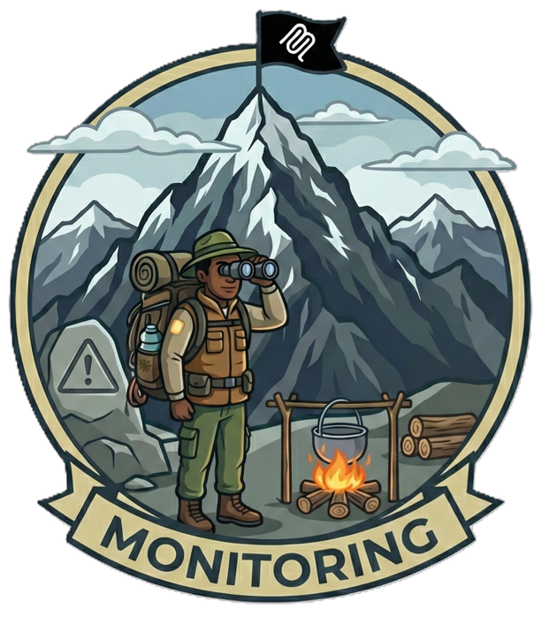

---
hide:
  - toc
---

# Camp 4: Monitoring & Telemetry

*Reaching Observation Peak*



!!! info "Camp Details"
    **Tech Stack:** Log Analytics, Application Insights, Azure Monitor, Workbooks, API Management, Container Apps, Functions, MCP  
    **Primary Risks:** [MCP08](https://microsoft.github.io/mcp-azure-security-guide/mcp/mcp08-telemetry/) (Lack of Audit and Telemetry)

## Welcome to Observation Peak!

You've made it to Camp 4, the last skill-building camp before the Summit! Throughout your journey, you've built authentication (Camp 1), MCP gateways (Camp 2), and I/O security (Camp 3). Your MCP server is now protected by multiple layers of defense.

But here's a question: **How do you know it's working?**

If an attacker probed your system last night, would you know? If your security function blocked 100 injection attempts yesterday, could you prove it to an auditor? If there's a sudden spike in attacks right now, would you be alerted?

This is where **observability** comes in, and it's just as important as the security controls themselves.

!!! quote "The Key Insight"
    Security controls without observability are like locks without security cameras. You might stop the intruder, but you'll never know they tried to get in.

## What You'll Learn

At Observation Peak, you'll learn to see *everything* happening across your MCP infrastructure:

!!! tip "Learning Objectives"
    - **Enable** APIM diagnostic settings for gateway, MCP, and AI gateway logs
    - **Configure** `ApiManagementGatewayMCPLog` for MCP tool invocation tracking
    - **Implement** structured security logging in Azure Functions with correlation IDs
    - **Query** logs using KQL for security investigations with full log correlation
    - **Build** security monitoring dashboards using Azure Workbooks
    - **Create** alert rules for attack pattern detection
    - **Perform** incident response exercises with cross-service log tracing

---

## Understanding Observability

Before diving into the hands-on work, let's understand why observability matters and what makes it different from basic logging.

### Logging vs. Observability

You might be thinking: *"I already have logs. My application writes to console. Isn't that enough?"*

Not quite. There's a crucial difference:

| Aspect | Basic Logging | Observability |
|--------|---------------|---------------|
| **What it captures** | Text messages | Structured events with dimensions |
| **How you search** | Grep through files | Query across services in seconds |
| **Correlation** | Manual, painful | Automatic via correlation IDs |
| **Visualization** | Read log files | Dashboards, charts, trends |
| **Alerting** | Custom scripts | Built-in threshold monitoring |

!!! example "A Tale of Two Approaches"
    **Basic logging:** `WARNING: Injection blocked: sql_injection`
    
    - Where did it come from? 🤷
    - What tool was targeted? 🤷
    - How many happened today? 🤷 (time to write a grep script...)
    
    **Structured observability:**
    ```json
    {
      "event_type": "INJECTION_BLOCKED",
      "injection_type": "sql_injection",
      "tool_name": "search-trails",
      "correlation_id": "abc-123-xyz",
      "caller_ip": "203.0.113.42",
      "timestamp": "2024-01-15T14:30:00Z"
    }
    ```
    
    Now you can instantly answer: *"Show me all SQL injections targeting the search-trails tool in the last hour, grouped by source IP."*

### The Three Pillars of Observability

Modern observability rests on three pillars:

<div class="grid cards" markdown>

- :material-format-list-bulleted:{ .lg .middle } __Logs__

    ---

    Discrete events that tell you *what happened*. "User called tool X" or "Injection blocked."

- :material-gauge:{ .lg .middle } __Metrics__

    ---

    Numerical measurements over time. Requests per second, error rates, latency percentiles.

- :material-map-marker-path:{ .lg .middle } __Traces__

    ---

    The path a request takes through your system. Essential for understanding "why was this slow?"

</div>

In this workshop, we focus primarily on **logs** (structured events) while touching on metrics and traces through correlation IDs.

---

## The Real-World Problem

Imagine this scenario: You're the security lead for a company using MCP servers. Your manager walks over and asks:

> "We had a security audit last week. The auditor wants to know how many attacks we've blocked in the past 30 days. Can you pull that report?"

Without proper monitoring, your answer might be: *"I'd have to grep through thousands of log files..."*

With structured telemetry, your answer is: *"Give me 30 seconds."*

```kusto
AppTraces
| where Properties.event_type == "INJECTION_BLOCKED"
| where TimeGenerated > ago(30d)
| summarize AttacksBlocked = count() by bin(TimeGenerated, 1d)
| render barchart
```

That's the power of observability.

---

## Meet Azure Monitor

Before we start configuring things, let's understand the Azure services we'll be working with. Think of Azure Monitor as your observability platform, it's actually a collection of services working together.

### The Azure Monitor Family

```
┌─────────────────────────────────────────────────────────────────────┐
│                         Azure Monitor                               │
│  ┌─────────────────┐  ┌─────────────────┐  ┌─────────────────────┐  │
│  │  Log Analytics  │  │   Application   │  │    Azure Monitor    │  │
│  │    Workspace    │  │    Insights     │  │      Alerts         │  │
│  │                 │  │                 │  │                     │  │
│  │  • Store logs   │  │  • Auto-collect │  │  • Threshold rules  │  │
│  │  • KQL queries  │  │    from apps    │  │  • Email/webhook    │  │
│  │  • Retention    │  │  • APM features │  │  • Action groups    │  │
│  └────────┬────────┘  └────────┬────────┘  └──────────┬──────────┘  │
│           │                    │                      │             │
│           └──────────────┬─────┴──────────────────────┘             │
│                          │                                          │
│              ┌───────────┴───────────┐                              │
│              │    Azure Workbooks    │                              │
│              │   (Visualizations)    │                              │
│              └───────────────────────┘                              │
└─────────────────────────────────────────────────────────────────────┘
```

**Log Analytics Workspace** is your central log repository. Think of it as a powerful database optimized for time-series log data. You query it using KQL (Kusto Query Language).

**Application Insights** is specifically designed for application monitoring. When you add it to your Azure Function, it automatically captures requests, exceptions, and traces, plus any custom events you log.

**Azure Workbooks** are interactive reports that combine text, KQL queries, and visualizations. They're perfect for security dashboards.

**Azure Monitor Alerts** let you define rules that trigger when conditions are met. "If more than 10 injections in 5 minutes, email the security team."

### How Logs Flow

Understanding the data flow helps when troubleshooting:

```
Your MCP Request
       │
       ▼
┌──────────────┐     Diagnostic Settings     ┌────────────────────┐
│     APIM     │ ─────────────────────────── │   Log Analytics    │
│   Gateway    │     GatewayLogs             │     Workspace      │
│              │     MCPServerLogs           │                    │
│              │     GenerativeAIGatewayLogs │  ApiManagement...  │
└──────┬───────┘                             │  tables            │
       │                                     └────────────────────┘
       │ Routes to
       ▼
┌──────────────┐     App Insights SDK        ┌────────────────────┐
│   Security   │ ─────────────────────────── │   Application      │
│   Function   │     Custom events +         │   Insights         │
│              │     auto-instrumentation    │                    │
│              │                             │  AppTraces table   │
└──────────────┘                             └────────────────────┘
```

!!! info "The 2-5 Minute Delay"
    Logs don't appear instantly in Log Analytics. Azure buffers and batches them for efficiency, resulting in a 2-5 minute ingestion delay. This is normal! When validating your setup, give it a few minutes before panicking.

---

## Workshop Pattern

Camp 4 follows the **hidden → visible → actionable** pattern:

<div class="grid cards" markdown>

- :material-eye-off:{ .lg .middle } __Hidden__

    ---

    Security works, but you can't see what's happening. APIM has no diagnostic settings. Function uses basic `logging.warning()`. Events occur without any visibility or tracking.

- :material-eye:{ .lg .middle } __Visible__

    ---

    Enable APIM diagnostics and deploy structured telemetry. Security events become queryable, searchable, and visualizable.

- :material-bell-ring:{ .lg .middle } __Actionable__

    ---

    Create dashboards for monitoring and alerts that notify you when something needs attention. Turn visibility into automated response.

</div>

**The workshop has 4 sections:**

| Section | Focus | Scripts |
|---------|-------|---------|
| **1. APIM Logging** | Enable diagnostic settings for gateway logs | `section1/1.1-exploit.sh` → `1.2-fix.sh` → `1.3-validate.sh` |
| **2. Function Observability** | Upgrade from basic to structured logging | `section2/2.1-exploit.sh` → `2.2-fix.sh` → `2.3-validate.sh` |
| **3. Dashboard & Alerts** | Make security actionable | `section3/3.1-deploy-workbook.sh`, `3.2-create-alerts.sh` |
| **4. Incident Response** | Test the complete system | `section4/4.1-simulate-attack.sh` |

## What You'll Build

<div class="grid cards" markdown>

- :material-math-log:{ .lg .middle } __Structured Logging__

    ---

    Transform generic log messages into rich, queryable events with custom dimensions like `event_type`, `category`, and `correlation_id`.

- :material-chart-line:{ .lg .middle } __Security Dashboard__

    ---

    Visualize attacks, PII redactions, and credential exposures in real-time with Azure Workbooks.

- :material-bell-alert:{ .lg .middle } __Smart Alerting__

    ---

    Get notified immediately when attack rates spike or credentials are exposed.

- :material-magnify:{ .lg .middle } __KQL Queries__

    ---

    Learn Kusto Query Language to analyze security events and create custom reports.

</div>

---

## Prerequisites

Before starting Camp 4, ensure you have:

:material-check: Azure subscription with Contributor access  
:material-check: Azure CLI installed and logged in (`az login`)  
:material-check: Azure Developer CLI installed (`azd`)  
:material-check: Completed Camp 3: I/O Security (recommended, but not required)

!!! note "Standalone Lab"
    While Camp 4 builds on concepts from earlier camps, it's designed to work standalone. The `azd provision` command will deploy everything you need, including the security function from Camp 3.

---

## A Quick KQL Primer

Throughout this workshop, you'll write queries in **KQL (Kusto Query Language)**. If you've never used it, don't worry—it's quite intuitive once you see a few examples.

### KQL Basics

KQL queries flow from left to right using the pipe (`|`) operator, similar to Unix commands:

```kusto
TableName
| where SomeColumn == "value"      // Filter rows
| project Column1, Column2         // Select columns
| summarize count() by Column1     // Aggregate
| order by count_ desc             // Sort
| limit 10                         // Take top N
```

### Essential Operators

| Operator | Purpose | Example |
|----------|---------|---------|
| `where` | Filter rows | `where ResponseCode >= 400` |
| `project` | Select/rename columns | `project TimeGenerated, CallerIpAddress` |
| `extend` | Add computed columns | `extend Duration = DurationMs/1000` |
| `summarize` | Aggregate | `summarize count() by ToolName` |
| `order by` | Sort | `order by TimeGenerated desc` |
| `limit` / `take` | Return N rows | `limit 20` |
| `render` | Visualize | `render timechart` |

### Working with JSON Properties

Logs often contain JSON in a `Properties` column. Extract values like this:

```kusto
AppTraces
| extend EventType = tostring(Properties.event_type)
| where EventType == "INJECTION_BLOCKED"
```

!!! tip "The tostring() Function"
    Always wrap JSON property access in `tostring()` when comparing to strings. This is a common gotcha that causes "no results" when the data is actually there.

### Time Filters

KQL has built-in time functions:

```kusto
| where TimeGenerated > ago(1h)     // Last hour
| where TimeGenerated > ago(7d)     // Last 7 days
| where TimeGenerated between (datetime(2024-01-01) .. datetime(2024-01-31))
```

You'll get plenty of practice with KQL as we go through the workshop. The [KQL Query Reference](#kql-query-reference) section at the end has queries you can copy and customize.

---

## Key Log Tables

This workshop focuses on these Azure Monitor log tables for MCP security monitoring:

| Log Table | APIM Category | Key Fields |
|-----------|---------------|------------|
| **ApiManagementGatewayLogs** | GatewayLogs | `CallerIpAddress`, `ResponseCode`, `RequestBody`, `ResponseBody`, `DurationMs`, `CorrelationId` |
| **ApiManagementGatewayMCPLog** | MCPServerLogs | `ToolName`, `ClientName`, `ClientVersion`, `AuthenticationMethod`, `SessionId`, `ServerName`, `Error`, `CorrelationId` |
| **ApiManagementGatewayLlmLog** | GenerativeAIGatewayLogs | `PromptTokens`, `CompletionTokens`, `ModelName`, `CorrelationId` |
| **AppTraces** | (App Insights) | `Message`, `SeverityLevel`, custom dimensions (`event_type`, `correlation_id`, `injection_type`) |

!!! tip "MCP-Specific Logging"
    **ApiManagementGatewayMCPLog** is particularly valuable for MCP security. It captures MCP protocol-level details that HTTP logs miss:
    
    - **ToolName** - Which MCP tool was called (e.g., `get-weather`, `search-trails`)
    - **ClientName/ClientVersion** - MCP client identification
    - **SessionId** - Track activity across an MCP session
    - **AuthenticationMethod** - How the client authenticated

!!! info "Correlation IDs"
    The **CorrelationId** field appears across all log tables and is essential for incident response. It allows you to trace a single request from APIM through the security function and back, correlating HTTP logs, MCP logs, and application traces.

## Getting Started

```bash
# Navigate to Camp 4
cd camps/camp4-monitoring

# Deploy infrastructure AND services (~15 minutes)
azd up
```

!!! warning "Use `azd up`, not `azd provision`"
    The `azd provision` command only creates Azure infrastructure (APIM, Function App, etc.) but doesn't deploy the actual code. Use `azd up` which does both:
    
    - **`azd provision`** = Create Azure resources only
    - **`azd deploy`** = Deploy code to existing resources  
    - **`azd up`** = Provision + Deploy (what you want!)

This deploys:

- **Security Function v1** - Azure Function with basic logging (the "hidden" state)
- **Log Analytics Workspace** - Central log storage for querying
- **Application Insights** - Telemetry collection
- **APIM Gateway** - API Management (diagnostics NOT enabled initially)
- **Container Apps** - MCP server and Trail API backends

!!! note "Initial State: Hidden"
    The initial deployment intentionally creates a "hidden" state:
    
    - APIM has no diagnostic settings (no ApiManagementGatewayLogs)
    - Security function uses basic `logging.warning()` (no custom dimensions)
    
    The workshop scripts will progressively enable visibility.

Once deployment completes, you're ready to start the workshop. Each section follows the "explore the problem → fix it → validate" pattern.

---

## Section 1: API Management Logging

APIM processes all your MCP traffic, but by default it doesn't send detailed logs to Log Analytics. This section enables diagnostic settings.

### The Logging Gap: Before & After

```
BEFORE: No Diagnostic Settings                 AFTER: Diagnostics Enabled
═══════════════════════════════════════        ═══════════════════════════════════════

   MCP Client                                     MCP Client
       │                                              │
       ▼                                              ▼
┌──────────────┐                                ┌──────────────┐
│    APIM      │                                │    APIM      │───────────────────┐
│   Gateway    │                                │   Gateway    │                   │
│              │                                │              │   Diagnostic      │
│  • Routes ✓  │                                │  • Routes ✓  │   Settings        │
│  • Policies ✓│                                │  • Policies ✓│                   │
│  • Logs? ❌  │                                │  • Logs ✓    │                   ▼
└──────┬───────┘                                └──────┬───────┘        ┌─────────────────┐
       │                                               │                │  Log Analytics  │
       ▼                                               ▼                │                 │
┌─────────────┐                                ┌─────────────┐          │ • GatewayLogs   │
│   Backend   │                                │   Backend   │          │ • MCPServerLogs │
│   Services  │                                │   Services  │          │ • LlmLogs       │
└─────────────┘                                └─────────────┘          └─────────────────┘
                                                                              │
Traffic works fine,                            Traffic works AND              ▼
but NO VISIBILITY                              you can QUERY everything    📊 KQL Queries
                                                                           📈 Dashboards
                                                                           🔔 Alerts
```

### Why APIM Logging Matters

Azure API Management sits at the front door of your MCP infrastructure. Every request, legitimate or malicious, passes through it. But here's the thing: **APIM doesn't log to Log Analytics by default**.

Without explicit configuration, APIM only:  

- Routes traffic (works fine)  
- Applies policies (works fine) 
- Returns responses (works fine)

But you have **zero visibility** into:  

- Who called your APIs (IP addresses)  
- What MCP tools were invoked  
- How long requests took  
- Which requests failed and why

!!! example "The Security Guard Analogy"
    It's like having a security guard who checks IDs but never writes anything down. The guard does their job, but there's no record anyone can review later.

### Understanding Diagnostic Settings

**Diagnostic Settings** are Azure's way of routing telemetry from a resource to a destination. For APIM, you configure:

- **Source**: Which log categories to capture (GatewayLogs, MCPServerLogs, etc.)
- **Destination**: Where to send them (Log Analytics workspace)

Once enabled, APIM automatically streams logs to your workspace. No code changes needed—it's pure configuration.

### 1.1 Experience the Gap

??? abstract "See What's Missing"

    Run the script to see the APIM logging gap:

    ```bash
    ./scripts/section1/1.1-exploit.sh
    ```

    **What this script does:**

    1. **Sends legitimate MCP requests** through APIM
    2. **Sends attack requests** (SQL injection, path traversal)
    3. **Checks APIM diagnostic settings** - spoiler: none configured!
    4. **Shows the KQL query** that would return nothing

    **The problem:**

    | What Works | What's Missing |
    |------------|----------------|
    | ✅ Requests routed through APIM | ❌ No record of who made requests |
    | ✅ Security function blocks attacks | ❌ No caller IP addresses |
    | ✅ Responses returned correctly | ❌ No query-able logs in Log Analytics |

    !!! warning "The Hidden Problem"
        Your gateway is routing traffic, but you have zero visibility into:
        
        - Who's calling your APIs (CallerIpAddress)
        - What's being called (Url, Method)
        - Request/response timing (TotalTime, BackendTime)
        - Correlation across services (CorrelationId)

### 1.2 Enable APIM Diagnostics

??? success "Make APIM Traffic Visible"

    Enable diagnostic settings:

    ```bash
    ./scripts/section1/1.2-fix.sh
    ```

    **What this does:**

    Creates diagnostic settings that send `GatewayLogs`, `MCPServerLogs`, and `GenerativeAIGatewayLogs` to your Log Analytics workspace.

    **ApiManagementGatewayLogs (HTTP level):**

    | Field | Description |
    |-------|-------------|
    | `CallerIpAddress` | Client IP (for investigations) |
    | `ResponseCode` | HTTP response code |
    | `RequestBody` / `ResponseBody` | Full request/response content |
    | `DurationMs` | End-to-end latency |
    | `CorrelationId` | For cross-service tracing |

    **ApiManagementGatewayMCPLog (MCP protocol level):**

    | Field | Description |
    |-------|-------------|
    | `ToolName` | Which MCP tool was called |
    | `ClientName` | MCP client identifier |
    | `ClientVersion` | Client version |
    | `AuthenticationMethod` | How the client authenticated |
    | `SessionId` | MCP session identifier |
    | `ServerName` | Target MCP server |
    | `Error` | Error details if any |

    **ApiManagementGatewayLlmLog (AI/LLM gateway):**

    | Field | Description |
    |-------|-------------|
    | `PromptTokens` | Input token count |
    | `CompletionTokens` | Output token count |
    | `ModelName` | LLM model used |
    | `CorrelationId` | For cross-service tracing |

### 1.3 Validate Logs Appear

??? success "Query APIM Logs"

    Verify logs are flowing:

    ```bash
    ./scripts/section1/1.3-validate.sh
    ```

    !!! note "Ingestion Delay"
        Azure Monitor has a 2-5 minute ingestion delay. If no logs appear, wait a few minutes and try again.

    **HTTP traffic query (ApiManagementGatewayLogs):**

    ```kusto
    ApiManagementGatewayLogs
    | where TimeGenerated > ago(1h)
    | where Url contains "/mcp/"
    | project TimeGenerated, CallerIpAddress, Method, Url, ResponseCode, DurationMs
    | order by TimeGenerated desc
    | limit 20
    ```

    **MCP tool usage query (ApiManagementGatewayMCPLog):**

    ```kusto
    ApiManagementGatewayMCPLog
    | where TimeGenerated > ago(1h)
    | summarize CallCount=count() by ToolName, ClientName
    | order by CallCount desc
    | limit 10
    ```

---

## Section 2: Function Observability

APIM logs show HTTP traffic, but the security function's internal operations (what attacks were blocked, what PII was found) are still invisible. This section upgrades from basic logging to structured telemetry.

### The Problem with Basic Logging

Most developers start with basic logging—and there's nothing wrong with that for debugging:

```python
logging.warning(f"Injection blocked: {category}")
```

This produces a log line like:
```
2024-01-15 14:30:00 WARNING Injection blocked: sql_injection
```

Simple, readable, and utterly useless for security analysis at scale. Why?

**You can't easily query it.** Want to count SQL injections vs. shell injections? You'd need to parse the text, hope the format doesn't change, and write fragile regex patterns.

**You can't correlate it.** Which APIM request triggered this log? There's no correlation ID to link them.

**You can't aggregate it.** How many attacks per hour? Per tool? Per source IP? Each question requires custom text parsing.

### Structured Logging: The Solution

Structured logging means emitting events as **key-value pairs** (dimensions) rather than formatted strings:

```python
log_security_event(
    event_type="INJECTION_BLOCKED",
    injection_type="sql_injection",
    tool_name="search-trails",
    correlation_id="abc-123-xyz"
)
```

This produces a log entry where each piece of information is a separate, queryable field. Now you can:

```kusto
// Count attacks by type (trivial!)
AppTraces
| where Properties.event_type == "INJECTION_BLOCKED"
| summarize count() by tostring(Properties.injection_type)

// Find all events for a specific request
AppTraces
| where Properties.correlation_id == "abc-123-xyz"
```

### What Are Custom Dimensions?

When you log with Azure Monitor/Application Insights, you can attach **custom dimensions**—arbitrary key-value pairs that become queryable fields.

In the `Properties` column of `AppTraces`, you'll find:

| Dimension | Example | Query Use |
|-----------|---------|-----------|
| `event_type` | `INJECTION_BLOCKED` | Filter security events |
| `injection_type` | `sql_injection` | Breakdown by attack category |
| `correlation_id` | `abc-123-xyz` | Cross-service tracing |
| `tool_name` | `search-trails` | Identify targeted tools |
| `severity` | `WARNING` | Filter by importance |

Think of custom dimensions as adding columns to your log database that you can filter, group, and aggregate.

### 2.1 See Basic Logging Limitations

??? abstract "Experience Unstructured Logs"

    Run the script to trigger security events:

    ```bash
    ./scripts/section2/2.1-exploit.sh
    ```

    **What you'll see in logs:**

    ```text
    WARNING: Injection blocked: sql_injection
    WARNING: PII detected and redacted: 3 entities
    ```

    **What you can't easily do:**

    - ❌ Query "how many SQL injections vs shell injections?"
    - ❌ Correlate with APIM logs (no correlation_id)
    - ❌ Build dashboards by attack category
    - ❌ Alert on specific injection types

### 2.2 Deploy Structured Logging

??? success "Upgrade to v2 with Custom Dimensions"

    Deploy the security function with structured telemetry:

    ```bash
    ./scripts/section2/2.2-fix.sh
    ```

    **What changes:**

    ```python
    # v1 (basic): Hard to query
    logging.warning(f"Injection blocked: {category}")

    # v2 (structured): Rich, queryable events
    log_injection_blocked(
        injection_type=result.category,
        reason=result.reason,
        correlation_id=correlation_id,
        tool_name=tool_name
    )
    ```

    **Custom dimensions now available:**

    | Dimension | Example Value | Why It Matters |
    |-----------|---------------|----------------|
    | `event_type` | `INJECTION_BLOCKED` | Filter by event category |
    | `injection_type` | `sql_injection` | Know exactly what was blocked |
    | `correlation_id` | `abc-123-xyz` | Trace across APIM + Function |
    | `tool_name` | `search-trails` | Identify targeted tools |

### 2.3 Validate Structured Logs

??? success "Query Security Events"

    Verify structured events appear:

    ```bash
    ./scripts/section2/2.3-validate.sh
    ```

    **Now you can query like this:**

    ```kusto
    AppTraces
    | where Properties has "event_type"
    | extend EventType = tostring(Properties.event_type),
             InjectionType = tostring(Properties.injection_type)
    | where EventType == "INJECTION_BLOCKED"
    | summarize Count=count() by InjectionType
    | order by Count desc
    ```

    **Correlate APIM + Function logs:**

    ```kusto
    let correlationId = "YOUR-CORRELATION-ID";
    union
        (ApiManagementGatewayLogs | where CorrelationId == correlationId),
        (AppTraces | where Properties.correlation_id == correlationId)
    | order by TimeGenerated
    ```

---

## Section 3: Dashboard & Alerts

Visibility is great, but you can't watch logs 24/7. This section makes security *actionable* with dashboards and alerts.

### From Visible to Actionable

At this point, you've achieved visibility:
- ✅ APIM logs flow to Log Analytics
- ✅ Security function emits structured events
- ✅ You can query anything with KQL

But there's a problem: **nobody has time to run KQL queries all day**.

The final step in the "hidden → visible → actionable" journey is making security events *surface themselves*:

- **Dashboards** give you at-a-glance status without running queries
- **Alerts** notify you when something needs attention, even at 3 AM

### Azure Workbooks: Interactive Dashboards

**Azure Workbooks** are interactive reports built on top of Log Analytics. They combine:

- **Text** - Explanations and context
- **KQL Queries** - Live data from your logs
- **Visualizations** - Charts, graphs, grids
- **Parameters** - Interactive filters (time range, environment, etc.)

Unlike static dashboards, Workbooks query live data every time you view them. No ETL pipelines, no data staleness—just direct queries against your logs.

!!! tip "Workbook vs. Dashboard"
    Azure has both **Workbooks** and **Dashboards**. What's the difference?
    
    - **Workbooks**: Rich, document-like reports with interactivity. Best for analysis.
    - **Dashboards**: Pinned tiles from various sources. Best for at-a-glance monitoring.
    
    For security monitoring, Workbooks are usually the better choice because you need the analytical depth.

### Azure Monitor Alerts: Automated Notification

Alerts watch your logs and take action when conditions are met. They have three components:

1. **Condition**: A KQL query that returns results when something's wrong
2. **Action Group**: Who to notify and how (email, SMS, webhook, Logic App)
3. **Severity**: How urgent is this? (0-4, where 0 is critical)

For example, our "High Attack Volume" alert:
- **Condition**: More than 10 `INJECTION_BLOCKED` events in 5 minutes
- **Action**: Email the security team
- **Severity**: 2 (Warning)

Alerts run on a schedule (every 5 minutes by default) and fire when the query returns results.

### 3.1 Deploy the Dashboard

??? abstract "Create Security Workbook"

    Deploy the Azure Monitor Workbook:

    ```bash
    ./scripts/section3/3.1-deploy-workbook.sh
    ```

    **Dashboard panels:**

    | Panel | Shows |
    |-------|-------|
    | Request Volume | MCP traffic over 24h |
    | Attacks by Type | Pie chart of injection categories |
    | Top Targeted Tools | Which MCP tools attackers probe |
    | Error Sources | IPs generating errors |
    | Recent Events | Live feed of security activity |

### 3.2 Create Alert Rules

??? success "Set Up Automated Notifications"

    Create alert rules:

    ```bash
    ./scripts/section3/3.2-create-alerts.sh
    ```

    **Alerts configured:**

    | Alert | Threshold | Severity |
    |-------|-----------|----------|
    | High Attack Volume | >10 attacks in 5 min | Warning |
    | Credential Exposure | Any detected | Error |

    !!! tip "Email Notifications"
        The script will prompt for an email address. You can skip this and view alerts in the Azure Portal instead.

---

## Section 4: Incident Response

Test the complete observability system with a simulated attack.

### Why Practice Incident Response?

Building a monitoring system is one thing. Actually using it under pressure is another.

Security teams practice incident response for the same reason firefighters practice drills: when the real thing happens, you don't want to be figuring things out for the first time.

In this section, you'll:
1. **Simulate a realistic attack** - Multiple attack vectors, realistic payloads
2. **Watch your dashboard light up** - See the "actionable" part in action
3. **Investigate using correlation IDs** - Trace the attack across services
4. **Verify alerts trigger** - Confirm your automated notifications work

### The Power of Correlation IDs

When investigating an incident, the most valuable tool is the **correlation ID**. Here's why:

A single user action might touch multiple services:
```
Client Request → APIM → Security Function → MCP Server → Database
```

Each service logs independently. Without correlation, you'd have:
- APIM log: "Request from 203.0.113.42"
- Function log: "Injection blocked: sql_injection"  
- MCP Server log: "Request failed"

Which function log matches which APIM request? 🤷

With correlation IDs, every service logs the same ID:
```
APIM:     correlation_id=abc-123, CallerIP=203.0.113.42
Function: correlation_id=abc-123, event_type=INJECTION_BLOCKED  
MCP:      correlation_id=abc-123, status=blocked
```

Now you can instantly reconstruct the full story:

```kusto
let id = "abc-123";
ApiManagementGatewayLogs | where CorrelationId == id
| union (AppTraces | where Properties.correlation_id == id)
| order by TimeGenerated
```

### 4.1 Simulate Multi-Vector Attack

??? warning "⚠️ Attack Simulation"

    Run the attack simulation:

    ```bash
    ./scripts/section4/4.1-simulate-attack.sh
    ```

    **Attack phases:**

    1. **Reconnaissance** - Probe for available tools
    2. **SQL Injection** - Multiple payload variations
    3. **Path Traversal** - Try to access system files
    4. **Shell Injection** - Command execution attempts
    5. **Prompt Injection** - AI jailbreak attempts

    **What to observe:**

    - 📊 Dashboard shows spike in attack volume
    - 🚨 "High Attack Volume" alert triggers
    - 📧 Email notification (if configured)

    **Full log correlation query:**

    The script outputs a correlation ID. Use it to trace the attack across ALL services:

    ```kusto
    // Correlate attack across APIM, MCP logs, and Function logs
    let attackerId = "attacker-TIMESTAMP";
    AppTraces
    | extend CorrelationId = tostring(Properties.correlation_id)
    | where CorrelationId startswith attackerId
    | join kind=leftouter (
        ApiManagementGatewayLogs
        | project CorrelationId, CallerIpAddress, ResponseCode, DurationMs
    ) on CorrelationId
    | join kind=leftouter (
        ApiManagementGatewayMCPLog
        | project CorrelationId, ToolName, ClientName, SessionId
    ) on CorrelationId
    | project TimeGenerated, CorrelationId, 
        EventType=tostring(Properties.event_type),
        InjectionType=tostring(Properties.injection_type),
        CallerIpAddress, ResponseCode, ToolName
    | order by TimeGenerated asc
    ```

---

## KQL Query Reference

This section is your **cheat sheet**—a collection of queries you'll use regularly for security monitoring. Bookmark this page!

Each query is designed to answer a specific question. Copy them into Log Analytics and modify as needed.

!!! tip "Running KQL Queries"
    To run these queries:
    
    1. Go to the Azure Portal → Log Analytics workspace
    2. Click **Logs** in the left menu
    3. Paste the query and click **Run**
    
    You can also save frequently-used queries for quick access.

### Security Events Summary

```kusto
AppTraces
| extend EventType = tostring(Properties.event_type)
| where EventType in ('INJECTION_BLOCKED', 'PII_REDACTED', 'CREDENTIAL_DETECTED')
| summarize Count=count() by EventType
| render piechart
```

### Attacks by Category

```kusto
AppTraces
| extend EventType = tostring(Properties.event_type)
| where EventType == 'INJECTION_BLOCKED'
| extend Category = tostring(Properties.category)
| summarize Count=count() by Category
| order by Count desc
```

### Attack Trends Over Time

```kusto
AppTraces
| extend EventType = tostring(Properties.event_type)
| where EventType == 'INJECTION_BLOCKED'
| summarize Count=count() by bin(TimeGenerated, 5m)
| render timechart
```

### Most Targeted MCP Tools

```kusto
AppTraces
| extend EventType = tostring(Properties.event_type)
| where EventType == 'INJECTION_BLOCKED'
| extend ToolName = tostring(Properties.tool_name)
| where isnotempty(ToolName)
| summarize Count=count() by ToolName
| top 10 by Count desc
```

### Trace a Single Request

```kusto
// Replace with an actual correlation ID from your logs
let correlation_id = "YOUR-CORRELATION-ID";
AppTraces
| extend CorrelationId = tostring(Properties.correlation_id)
| where CorrelationId == correlation_id
| project TimeGenerated, Message, Properties
| order by TimeGenerated asc
```

### Full Log Correlation (Incident Response)

Use CorrelationId to trace a request across ALL log tables:

```kusto
// Cross-service investigation using CorrelationId
let correlationId = "YOUR-CORRELATION-ID";
// APIM HTTP logs
ApiManagementGatewayLogs
| where CorrelationId == correlationId
| project TimeGenerated, Source="APIM-HTTP", CallerIpAddress, ResponseCode, DurationMs
| union (
    // APIM MCP logs  
    ApiManagementGatewayMCPLog
    | where CorrelationId == correlationId
    | project TimeGenerated, Source="APIM-MCP", ToolName, ClientName, SessionId
)
| union (
    // Security function logs
    AppTraces
    | extend CorrelationId = tostring(Properties.correlation_id)
    | where CorrelationId == correlationId
    | extend EventType = tostring(Properties.event_type)
    | project TimeGenerated, Source="Function", EventType, Message
)
| order by TimeGenerated asc
```

### Suspicious Client Analysis

```kusto
// Find clients with high attack rates
ApiManagementGatewayMCPLog
| where TimeGenerated > ago(24h)
| join kind=inner (
    AppTraces
    | extend EventType = tostring(Properties.event_type)
    | where EventType == "INJECTION_BLOCKED"
    | extend CorrelationId = tostring(Properties.correlation_id)
) on CorrelationId
| summarize AttackCount=count() by ClientName, SessionId
| where AttackCount > 5
| order by AttackCount desc
```

### MCP Tool Risk Assessment

```kusto
// Which tools are most frequently targeted?
ApiManagementGatewayMCPLog
| where TimeGenerated > ago(7d)
| join kind=leftouter (
    AppTraces
    | extend EventType = tostring(Properties.event_type)
    | where EventType == "INJECTION_BLOCKED"
    | extend CorrelationId = tostring(Properties.correlation_id)
) on CorrelationId
| summarize TotalCalls=count(), AttackAttempts=countif(isnotempty(EventType)) by ToolName
| extend AttackRate = round(100.0 * AttackAttempts / TotalCalls, 2)
| order by AttackRate desc
```

---

## Architecture Deep Dive

Let's look at how all the pieces fit together. Understanding this architecture helps when troubleshooting and when designing your own monitoring solutions.

### Data Flow: From Request to Dashboard

```
┌─────────────────────────────────────────────────────────────────┐
│                         MCP Client                               │
└───────────────────────────────┬─────────────────────────────────┘
                                │ HTTPS Request
                                ▼
┌─────────────────────────────────────────────────────────────────┐
│                     API Management (APIM)                        │
│   • Receives all MCP traffic                                    │
│   • Applies policies (auth, rate limiting)                      │
│   • Generates CorrelationId for tracing                         │
│   • Routes to security function                                 │
│                                                                 │
│   Diagnostic Settings → Log Analytics                           │
│   └── GatewayLogs (HTTP details)                               │
│   └── MCPServerLogs (Tool invocations)                         │
│   └── GenerativeAIGatewayLogs (LLM usage)                      │
└───────────────────────────────┬─────────────────────────────────┘
                                │
                                ▼
┌─────────────────────────────────────────────────────────────────┐
│                    Security Function                             │
│   • Receives forwarded request + CorrelationId                  │
│   • Checks for injection patterns                               │
│   • Scans for PII/credentials in responses                      │
│   • Logs structured events with custom dimensions               │
│                                                                 │
│   Application Insights SDK → AppTraces table                    │
│   └── event_type, injection_type, correlation_id               │
└─────────────────────────────────────────────────────────────────┘
```

### The Security Event Types

The security function emits five distinct event types, each serving a specific purpose:

| Event Type | When Emitted | Severity | What to Do |
|------------|--------------|----------|------------|
| `INJECTION_BLOCKED` | Attack pattern detected in input | WARNING | Investigate source, consider blocking IP |
| `PII_REDACTED` | Personal data found and masked in output | INFO | Normal operation, audit trail |
| `CREDENTIAL_DETECTED` | API keys/tokens found in output | ERROR | Immediate investigation, possible breach |
| `INPUT_CHECK_PASSED` | Request passed all security checks | DEBUG | Normal operation |
| `SECURITY_ERROR` | Security function itself failed | ERROR | Check function health, review logs |

### Log Table Relationships

Here's how the tables connect via CorrelationId:

```
ApiManagementGatewayLogs           ApiManagementGatewayMCPLog
┌────────────────────────┐         ┌─────────────────────────┐
│ CorrelationId: abc-123 │────┬────│ CorrelationId: abc-123  │
│ CallerIpAddress: ...   │    │    │ ToolName: search-trails │
│ ResponseCode: 200      │    │    │ ClientName: vscode-ext  │
│ DurationMs: 150        │    │    │ SessionId: sess-456     │
└────────────────────────┘    │    └─────────────────────────┘
                              │
                              │    AppTraces
                              │    ┌─────────────────────────┐
                              └────│ correlation_id: abc-123 │
                                   │ event_type: INJECTION.. │
                                   │ injection_type: sql_... │
                                   └─────────────────────────┘
```

This is why correlation IDs are so powerful: one ID links together HTTP details, MCP protocol information, and security events.

---

## Troubleshooting

Things don't always work the first time. Here are the most common issues and how to fix them.

??? question "My KQL queries return no results"

    **Don't panic!** This is the #1 issue people hit. Check these things in order:

    1. **Wait 2-5 minutes.** Logs don't appear instantly. If you just enabled diagnostics or deployed the function, grab a coffee and try again.

    2. **Check your time range.** The default in Log Analytics might be "Last 24 hours"—if you just deployed, try "Last 1 hour" or "Last 30 minutes".

    3. **Verify diagnostic settings exist:**
       ```bash
       az monitor diagnostic-settings list \
         --resource "/subscriptions/.../providers/Microsoft.ApiManagement/service/YOUR-APIM" \
         --query "[].name"
       ```

    4. **Verify Application Insights is connected:**
       ```bash
       az functionapp config appsettings list \
         --name $FUNCTION_APP_NAME \
         --resource-group $AZURE_RESOURCE_GROUP \
         --query "[?name=='APPLICATIONINSIGHTS_CONNECTION_STRING']"
       ```

    5. **Generate some events!** Run the exploit scripts to create log entries, then wait a few minutes.

??? question "The dashboard shows 'No data'"

    **Workbooks need data to display.** If panels are empty:

    1. **Adjust the time range** at the top of the workbook to a wider window (try "Last 7 days")
    
    2. **Generate events** by running:
       ```bash
       ./scripts/section4/4.1-simulate-attack.sh
       ```
    
    3. **Wait for ingestion** (2-5 minutes), then refresh the workbook

    4. **Check the workspace connection** - Make sure the workbook is querying the right Log Analytics workspace

??? question "Alerts aren't firing even though I see events"

    **Alerts run on a schedule, not in real-time:**

    1. **Alert evaluation interval**: Default is every 5 minutes. Wait at least 10 minutes after generating events.

    2. **Check thresholds**: The "High Attack Volume" alert requires >10 attacks in 5 minutes. Did you generate enough events?

    3. **Verify the alert is enabled**:
       - Azure Portal → Monitor → Alerts → Alert rules
       - Check that your rules show "Enabled"

    4. **Check action group**: Even if the alert fires, notifications need a properly configured action group with valid email/webhook.

??? question "Properties.event_type returns nothing but I see the data"

    **JSON property access is tricky in KQL:**

    - Always use `tostring()`:
      ```kusto
      | extend EventType = tostring(Properties.event_type)  // ✅ Works
      | where Properties.event_type == "INJECTION_BLOCKED"  // ❌ Often fails
      ```

    - Property names are case-sensitive:
      ```kusto
      Properties.event_type  // ✅
      Properties.Event_Type  // ❌
      ```

    - Check what's actually in Properties:
      ```kusto
      AppTraces | take 1 | project Properties
      ```

??? question "I'm seeing 'Request rate is large' errors"

    **You might be hitting rate limits.** This happens if you:
    
    - Run attack simulations too fast
    - Have multiple people using the same deployment
    
    Solution: Wait a few minutes, or add delays between requests in your scripts.

---

## Cleanup

```bash
# Remove all Azure resources
azd down --force --purge

# Clean up Entra ID apps (optional)
az ad app delete --id $(azd env get-value MCP_APP_CLIENT_ID)
az ad app delete --id $(azd env get-value APIM_CLIENT_APP_ID)
```

---

## Congratulations! 🎉

You've completed Camp 4: Monitoring & Telemetry and reached **Observation Peak**! One more climb to go—the Summit awaits.

### Your Journey: Hidden → Visible → Actionable

Think back to where you started:

| Before | After |
|--------|-------|
| APIM routed traffic silently | Every request logged with caller IP, tool name, session ID |
| Function logged basic warnings | Structured events with custom dimensions for rich querying |
| No way to see attack patterns | Real-time dashboard showing security posture |
| Manual log checking | Automated alerts notify you of threats |

You've transformed your MCP infrastructure from a "black box" into a fully observable system.

### What You've Accomplished

- ✅ **Enabled APIM diagnostics** with GatewayLogs, MCPServerLogs, and GenerativeAIGatewayLogs
- ✅ **Implemented structured logging** with correlation IDs and custom dimensions
- ✅ **Built a security dashboard** using Azure Workbooks
- ✅ **Configured alert rules** for attack detection
- ✅ **Learned KQL** for security investigations
- ✅ **Practiced incident response** with cross-service log correlation

### The Hidden → Visible → Actionable Pattern

This pattern applies beyond just monitoring:

- **Hidden problems** → Use diagnostics, logging, tracing to make them **visible**
- **Visible data** → Use dashboards, alerts, automation to make it **actionable**

Whenever you deploy something new, ask yourself: "If this breaks at 3 AM, how will I know? How will I investigate?"

### Skills You've Gained

| Skill | What You Can Now Do |
|-------|---------------------|
| **Azure Monitor** | Configure diagnostic settings, use Log Analytics |
| **KQL** | Write queries to investigate security events |
| **Structured Logging** | Design log events that are queryable at scale |
| **Dashboarding** | Build Workbooks for security visualization |
| **Alerting** | Create rules that notify on security thresholds |
| **Incident Response** | Trace requests across services using correlation IDs |

---

## 🏔️ Almost at the Summit!

You've completed all four skill-building camps:

| Camp | What You Secured |
|------|------------------|
| **Base Camp** | Understanding MCP vulnerabilities |
| **Camp 1: Identity** | OAuth 2.0 + Entra ID authentication |
| **Camp 2: Gateway** | APIM protection + rate limiting |
| **Camp 3: I/O Security** | Input validation + output sanitization |
| **Camp 4: Monitoring** | Full observability + alerting |

Your MCP servers are now **authenticated**, **protected**, **validated**, and **observable**.

!!! tip "What's Next: The Summit"
    You've learned all the individual security skills. Now it's time to put them all together!
    
    The **Summit** is where you'll deploy the complete secure MCP infrastructure and test it with realistic red team / blue team exercises.

**One more climb to go!** 🏔️

---

← [Camp 3: I/O Security](camp3-io-security.md) | [The Summit →](summit.md)
