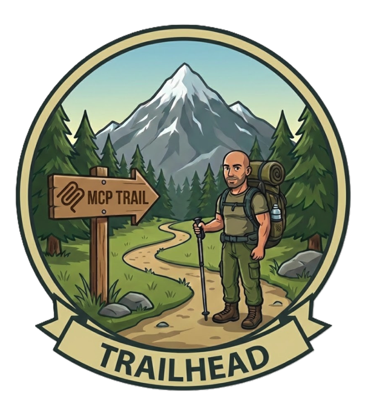

---
hide:
  - toc
---

# Trail Head: MCP Fundamentals

*Know the Protocol Before You Secure It*



Welcome to the **Trail Head**, your starting point for the MCP Security Summit. Before we tackle security vulnerabilities and production-grade protections, you need to understand what the Model Context Protocol (MCP) is and how it works. Think of this as studying the map before you start the climb.

!!! tip "Already familiar with MCP?"
    If you've already built or worked with MCP servers, feel free to skip ahead to **[Base Camp](base-camp.md)** where the security journey begins. This section is designed for those new to MCP.

**Duration:** ~15 minutes  
**No coding required** — just exploration and configuration

---

## What is the Model Context Protocol (MCP)?

The **Model Context Protocol (MCP)** is an open standard for connecting AI applications to data sources and tools. It provides a common communication protocol so any AI system can work with any data source, without requiring custom integrations for each combination.

Think of MCP like USB for AI: just as USB lets any device connect to any computer with a standard interface, MCP lets any AI application connect to any data source or tool with a standard protocol.

!!! info "Learn More"
    - [Introduction to MCP](https://modelcontextprotocol.io/introduction) — Official MCP documentation
    - [MCP Specification](https://spec.modelcontextprotocol.io/) — Technical specification

---

## MCP Architecture

At its core, MCP connects AI applications (like VS Code or Claude Desktop) to data sources and tools (like databases, APIs, and file systems). The protocol sits in the middle, enabling bidirectional communication so AI applications can discover capabilities and invoke them on demand.

```
┌─────────────────────┐                              ┌─────────────────────┐
│                     │                              │                     │
│  AI Applications    │        ┌─────────────┐       │  Data Sources       │
│                     │        │             │       │  and Tools          │
│  • Claude Desktop   │◄──────►│     MCP     │◄─────►│                     │
│  • VS Code          │        │             │       │  • Databases        │
│  • Custom AI Agents │        │ Standardized│       │  • APIs             │
│  • ChatGPT          │        │  Protocol   │       │  • File Systems     │
│                     │        │             │       │  • Dev Tools        │
│                     │        └─────────────┘       │                     │
└─────────────────────┘                              └─────────────────────┘
     (Hosts/Clients)          Bidirectional                (MCP Servers)
                               Data Flow
```

| Component | Role | Examples |
|-----------|------|----------|
| **Hosts/Clients** | AI applications that connect to MCP servers | VS Code, Claude Desktop, custom agents |
| **MCP Protocol** | Standardized communication layer | JSON-RPC over HTTP or stdio |
| **MCP Servers** | Services that expose data and functionality | Databases, APIs, file systems, dev tools |

---

## Core Concepts

MCP servers can expose three types of capabilities to clients:

### :material-hammer-wrench: Tools

**Tools** are functions that the AI can call to perform actions. They're the "verbs" of MCP—things the AI can *do*.

```json
{
  "name": "search_docs",
  "description": "Search Microsoft documentation",
  "inputSchema": {
    "type": "object",
    "properties": {
      "query": { "type": "string", "description": "Search query" }
    }
  }
}
```

**Examples:** Search a database, send an email, create a file, query an API

### :material-file-document: Resources

**Resources** are data that the AI can read. They're the "nouns" of MCP—things the AI can *access*.

```
user://user_001          → User profile data
file:///path/to/doc.md   → File contents
config://app/settings    → Application configuration
```

**Examples:** User profiles, documents, configuration files, database records

### :material-script-text: Prompts

**Prompts** are reusable prompt templates that servers can provide. They help standardize how AI interacts with specific domains.

**Examples:** Code review template, SQL query generator, document summarizer

---

## Transports: How MCP Communicates

MCP supports multiple transport mechanisms for client-server communication:

| Transport | Description | Use Case |
|-----------|-------------|----------|
| **stdio** | Communication over standard input/output | Local servers, CLI tools |
| **HTTP** | Standard HTTP requests/responses | Cloud-hosted servers, APIs |
| **Streamable HTTP** | HTTP with Server-Sent Events (SSE) | Real-time updates, long-running operations |

In this workshop, we'll primarily use **HTTP** and **Streamable HTTP** transports since they're most common for production deployments—and they're where most security considerations apply.

---

## Hands-On: Explore MCP with MCP Inspector

Let's explore MCP hands-on using **MCP Inspector**, an interactive tool for testing MCP servers. We'll connect to Microsoft's public MCP server that provides documentation search capabilities.

### Step 1: Launch MCP Inspector

MCP Inspector is a browser-based tool that lets you explore MCP servers interactively.

```bash
npx @modelcontextprotocol/inspector
```

This opens a browser window with the MCP Inspector interface.

### Step 2: Connect to Microsoft Learn MCP Server

In MCP Inspector:

1. Set **Transport Type** to `Streamable HTTP`
2. Enter the URL: `https://learn.microsoft.com/api/mcp`
3. Click **Connect**

You should see a successful connection. The server exposes Microsoft's documentation search capabilities.

### Step 3: Discover Available Tools

Click on the **Tools** tab to see what the server offers. You'll find:

| Tool | Description |
|------|-------------|
| `microsoft_docs_search` | Search across Microsoft Learn documentation |

This is a read-only, public server—perfect for learning MCP without any security risks.

### Step 4: Try a Search

1. Click on `microsoft_docs_search`
2. Enter a search query like `"Model Context Protocol security"`
3. Click **Run**

You'll see the server return relevant documentation snippets. This is MCP in action: an AI application (MCP Inspector) connecting to a data source (Microsoft Docs) through a standardized protocol.

!!! success "What You Just Did"
    You connected to a live MCP server, discovered its capabilities, and invoked a tool—all without writing any code. This is exactly how AI assistants like GitHub Copilot interact with MCP servers.

---

## Hands-On: Configure VS Code for MCP

VS Code has built-in MCP support through GitHub Copilot. Let's configure it to connect to the Microsoft Learn server.

### Step 1: Create MCP Configuration

In your workspace, create or edit `.vscode/mcp.json`:

```json
{
    "servers": {
        "microsoft-learn": {
            "type": "http",
            "url": "https://learn.microsoft.com/api/mcp"
        }
    }
}
```

### Step 2: Verify Connection

1. Open the Command Palette (`Cmd+Shift+P` / `Ctrl+Shift+P`)
2. Search for **"MCP: List Servers"**
3. You should see `microsoft-learn` listed

Now GitHub Copilot can use Microsoft's documentation search when answering your questions!

!!! tip "Try It Out"
    In Copilot Chat, ask: *"Using the microsoft-learn MCP server, search for Azure Container Apps deployment"*
    
    Copilot will use the MCP server to fetch relevant documentation.

---

## Why Does MCP Need Security?

Now that you understand how MCP works, consider this scenario:

> An MCP server exposes a `get_user_info` tool that returns user profiles including email, SSN, and account balances. The server has **no authentication**—anyone who knows the URL can connect.

This is exactly what you'll exploit in **Base Camp**. The same protocol that makes it easy for AI assistants to access data also makes it easy for attackers to access that data if proper security isn't in place.

**Key security questions MCP deployments must answer:**

- :material-account-question: **Authentication:** Who is connecting to this server?
- :material-shield-lock: **Authorization:** What are they allowed to access?
- :material-eye-off: **Data Protection:** How do we protect sensitive information?
- :material-monitor-eye: **Monitoring:** How do we detect misuse?

These questions form the core of what you'll learn in the camps ahead.

---

## Summary: What You've Learned

!!! success "Trail Head Complete!"
    You now understand:
    
    - :material-check: **What MCP is** — A protocol connecting AI apps to data sources and tools
    - :material-check: **Core concepts** — Tools (actions), Resources (data), Prompts (templates)
    - :material-check: **Transports** — stdio for local, HTTP for cloud
    - :material-check: **Hands-on exploration** — Using MCP Inspector to connect to live servers
    - :material-check: **VS Code integration** — Configuring MCP servers for GitHub Copilot
    - :material-check: **Why security matters** — Unauthenticated servers expose everything

---

## What's Next?

You're ready to begin the real climb. Head to **[Base Camp](base-camp.md)** where you'll:

- Run an intentionally vulnerable MCP server
- Exploit it to access sensitive user data
- Implement basic authentication
- Validate your security fix

The "vulnerable → exploit → fix → validate" methodology starts now.

<div class="grid cards" markdown>

-   :material-arrow-right-bold:{ .lg .middle } **Continue to Base Camp**

    ---

    Start the security journey with hands-on vulnerability exploitation

    [:octicons-arrow-right-24: Base Camp](base-camp.md)

</div>
