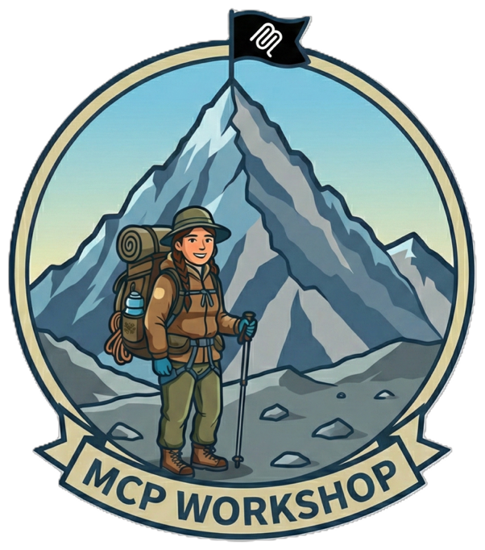

# 🏔️ Welcome to the MCP Security Summit

*A Sherpa's Guide to Securing Model Context Protocol Servers in Azure*



<div class="grid cards" markdown>

- :material-tent:{ .lg .middle } __Base Camp__

    ---

    Start your expedition with MCP fundamentals and basic authentication

    [:octicons-arrow-right-24: Begin the ascent](camps/base-camp.md)

- :material-shield-lock:{ .lg .middle } __Camp 1: Identity__

    ---

    OAuth 2.1, Managed Identity, and Key Vault secrets management

    [:octicons-arrow-right-24: Secure your identity](camps/camp1-identity.md)

- :material-router:{ .lg .middle } __Camp 2: MCP Gateway__

    ---

    API Management, Private Endpoints, and API Center governance

    [:octicons-arrow-right-24: Build the gateway](camps/camp2-gateway.md)

- :material-shield-check:{ .lg .middle } __Camp 3: I/O Security__

    ---

    Content Safety, input validation, and PII protection

    [:octicons-arrow-right-24: Secure your data](camps/camp3-io-security.md)

- :material-chart-line:{ .lg .middle } __Camp 4: Monitoring__

    ---

    Log Analytics, dashboards, and threat detection

    [:octicons-arrow-right-24: Watch the horizon](camps/camp4-monitoring.md)

- :material-summit:{ .lg .middle } __The Summit__

    ---

    Coming soon: Red Team / Blue Team exercise

    [:octicons-arrow-right-24: Reach the peak](#)

</div>

## What You'll Learn

This workshop teaches you to secure Model Context Protocol (MCP) servers in Azure using a proven "vulnerable → exploit → fix → validate" methodology. Each camp builds on the previous, creating comprehensive defense-in-depth security.

!!! info "Workshop Duration & Format"

    **Full workshop:** 6-7 hours  
    **Each camp:** 60-90 minutes  
    **Format:** Hands-on labs with live exploitation and remediation

## Prerequisites

Before starting your expedition, ensure you have:

- [x] Azure subscription with Contributor access
- [x] VS Code with GitHub Copilot or MCP extension
- [x] Azure CLI installed and authenticated
- [x] Python 3.10+ installed
- [x] Basic familiarity with Azure Portal

!!! tip "No Security Expertise Required"
    This workshop is designed for developers of all skill levels. If you can write Python code and navigate the Azure Portal, you're ready to climb!

## The Journey

Our expedition follows a proven path—each camp builds on the last:

| Stop | Theme | OWASP Risks | Duration |
| :----: | ------- | :-----------: | :--------: |
| __Base Camp__ | Understanding the Mountain | MCP07, MCP01, MCP02 | 60 min |
| __Camp 1__ | Establishing Your Identity | MCP07, MCP01, MCP02 | 90 min |
| __Camp 2__ | Scaling the Gateway Ridge | MCP09, MCP02, MCP07 | 95 min |
| __Camp 3__ | Navigating I/O Pass | MCP06, MCP05, MCP03 | 90 min |
| __Camp 4__ | Observation Peak | MCP08 | 90 min |
| __Summit__ | Full Integration | All risks validated | 2 hrs |

## Reference Materials

!!! quote "Your Companion Guide"
    Throughout this workshop, we reference the comprehensive __[OWASP MCP Azure Security Guide](https://microsoft.github.io/mcp-azure-security-guide/)__ for deeper dives on each security risk.

__Additional Resources:__

- [MCP Specification 2025-11-25](https://modelcontextprotocol.io/specification/2025-11-25)
- [MCP Security Best Practices](https://modelcontextprotocol.io/.../basic/security_best_practices)

## Getting Started

Ready to begin? Follow these steps:

=== "Step 1: Clone"

    ```bash
    git clone https://github.com/Azure-Samples/sherpa.git
    cd sherpa
    ```

=== "Step 2: Setup"

    ```bash
    # Install uv for fast dependency management
    curl -LsSf https://astral.sh/uv/install.sh | sh
    
    # Verify prerequisites
    python --version  # Should be 3.10+
    az --version      # Azure CLI installed
    az account show   # Authenticated
    ```

=== "Step 3: Start"

    ```bash
    # Begin at Base Camp
    cd camps/base-camp
    ```

---

<div class="grid" markdown>

!!! success "Ready to Climb?"
    Head to [Base Camp](camps/base-camp.md) to begin your expedition!

!!! info "Contributing"
    Want to improve this workshop? See our [Contributing Guidelines](resources/contributing.md)

</div>

---

*"The mountain doesn't care about your excuses. Prepare well, climb smart, reach the summit."* 🏔️
