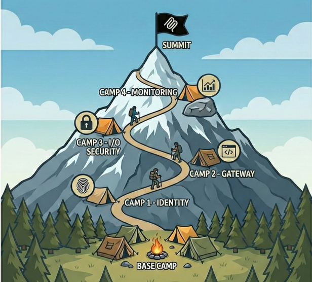

---
hide:
  - navigation
---

# 🏔️ Welcome to the MCP Security Summit Workshop

## A Sherpa's Guide to Securing Model Context Protocol Servers in Azure


## About This Workshop

*The summit awaits, but the climb itself teaches you everything you need to know.*

The **Model Context Protocol (MCP)** opens exciting new routes for AI applications to connect with data sources and tools, but like any unexplored peak, the terrain requires preparation. Unsecured MCP servers expose dangerous attack surfaces: authentication bypasses, data leakage, and unauthorized access threaten systems that lack proper defenses.

This workshop is your guided expedition to securing MCP servers in Microsoft Azure. You'll experience real vulnerabilities firsthand (by exploiting intentionally insecure systems), then learn proven techniques to fortify your defenses using Azure's native security services. By the time you reach the summit, you'll have climbed from basic authentication to enterprise-grade defense-in-depth with working code you can deploy in production.

!!! tip "What Makes This Expedition Unique"

    :material-target: **Learn by Breaking Things** - Experience vulnerabilities firsthand by exploiting intentionally insecure servers before learning to fix them

    :material-shield-check: **Azure-Native Security** - Leverage Azure Entra ID, Key Vault, API Management, AI Foundry, and other platform services designed for production workloads

    :material-routes: **Defense-in-Depth Journey** - Ascend through progressive camps, each building on the last to create comprehensive security layers

    :material-book-open-variant: **OWASP-Aligned** - Every technique maps directly to the [OWASP MCP Azure Security Guide](https://microsoft.github.io/mcp-azure-security-guide/), giving you industry-standard knowledge

    :material-code-braces: **Real Production Code** - Walk away with working, tested implementations you can adapt for your own projects

Whether you're a developer building your first MCP server or a security professional hardening existing systems, this workshop provides practical, actionable knowledge through a proven **"vulnerable → exploit → fix → validate"** methodology.

---

## The Expedition Route

Your journey follows a proven camp-to-camp progression. Each stage builds on the last, from reconnaissance at Base Camp to the final Red Team challenge at The Summit.



<div class="grid cards" markdown>

- :material-tent:{ .lg .middle } __Base Camp__

    ---

    **Understanding the Mountain** - Explore MCP fundamentals and witness authentication vulnerabilities in action  
    *OWASP Risks: MCP07, MCP01, MCP02*

    [:octicons-arrow-right-24: Begin the ascent](camps/base-camp.md)

- :material-shield-lock:{ .lg .middle } __Camp 1: Identity__

    ---

    **Establishing Your Identity** - Leverage OAuth 2.1, Azure Managed Identity, and Key Vault secrets management  
    *OWASP Risks: MCP07, MCP01, MCP02*

    [:octicons-arrow-right-24: Secure your identity](camps/camp1-identity.md)

- :material-router:{ .lg .middle } __Camp 2: MCP Gateway__

    ---

    **Scaling the Gateway Ridge** - Deploy API Management, Private Endpoints, and API Center governance  
    *OWASP Risks: MCP09, MCP02, MCP07*

    [:octicons-arrow-right-24: Build the gateway](camps/camp2-gateway.md)

- :material-shield-check:{ .lg .middle } __Camp 3: I/O Security__

    ---

    **Navigating I/O Pass** - Protect against prompt injection, PII leakage, and malicious content  
    *OWASP Risks: MCP06, MCP05, MCP03*

    [:octicons-arrow-right-24: Secure your data](camps/camp3-io-security.md)

- :material-chart-line:{ .lg .middle } __Camp 4: Monitoring__

    ---

    **Observation Peak** - Implement Log Analytics, dashboards, and automated threat detection  
    *OWASP Risks: MCP08*

    [:octicons-arrow-right-24: Watch the horizon](camps/camp4-monitoring.md)

- :material-summit:{ .lg .middle } __The Summit__

    ---

    **Full Integration Test** - Red Team / Blue Team exercise validating all security layers  
    *All OWASP Risks Validated*

    [:octicons-arrow-right-24: Reach the peak](#)

</div>

---

## What You'll Build

By the end of this expedition, you'll have climbed from vulnerable prototype to production-ready MCP architecture:

**:material-check-circle: Production-Ready Authentication** - OAuth 2.1 with PKCE, Azure Entra ID integration, and passwordless Managed Identity

**:material-check-circle: Hardened Network Perimeter** - Private endpoints, API Management gateway, and zero-trust networking

**:material-check-circle: Content Security Controls** - Input validation, Azure AI Content Safety integration, and PII detection

**:material-check-circle: Operational Monitoring** - Centralized logging, custom dashboards, and automated alerting

**:material-check-circle: Compliance Documentation** - OWASP risk mappings and audit trails for security reviews

---

## Prerequisites

Before starting your expedition, ensure you have:

:material-check: Azure subscription with Contributor access  
:material-check: VS Code with GitHub Copilot or MCP extension  
:material-check: Azure CLI installed and authenticated  
:material-check: Python 3.10+ installed  
:material-check: Basic familiarity with Azure Portal

!!! tip "No Security Expertise Required"
    This workshop is designed for developers of all skill levels. If you can write Python code and navigate the Azure Portal, you're ready to climb!

!!! info "Workshop Format"
    **Hands-on labs** with live exploitation and remediation exercises  
    **Each camp** includes: vulnerable code → exploit → secure implementation → validation  
    **Self-paced** with optional instructor-led checkpoints

---

## Getting Started

Ready to begin your expedition? Follow these three simple steps:

=== "Step 1: Clone the Repository"

    ```bash
    git clone https://github.com/Azure-Samples/sherpa.git
    cd sherpa
    ```

=== "Step 2: Verify Prerequisites"

    ```bash
    # Install uv for fast dependency management
    curl -LsSf https://astral.sh/uv/install.sh | sh
    
    # Verify Python version
    python --version  # Should be 3.10 or higher
    
    # Verify Azure CLI is installed and authenticated
    az --version
    az account show
    ```

=== "Step 3: Start at Base Camp"

    ```bash
    # Navigate to Base Camp to begin
    cd camps/base-camp
    
    # Follow the README for setup instructions
    ```

---

## Reference Materials

!!! info "Your Companion Guide"
    Throughout this workshop, we reference the comprehensive **[OWASP MCP Azure Security Guide](https://microsoft.github.io/mcp-azure-security-guide/)** for deeper technical explanations of each security risk and mitigation strategy.


**Additional Resources:**

:material-book: [MCP Specification 2025-11-25](https://modelcontextprotocol.io/specification/2025-11-25) - Official protocol documentation  
:material-shield: [MCP Security Best Practices](https://modelcontextprotocol.io/.../basic/security_best_practices) - Community security guidance  
:material-github: [FastMCP Framework](https://github.com/jlowin/fastmcp) - Python framework used in this workshop

---

<div class="grid" markdown>

!!! success "Ready to Climb?"
    Head to [Base Camp](camps/base-camp.md) to begin your expedition!

!!! info "Contributing"
    Want to improve this workshop? See our [Contributing Guidelines](resources/contributing.md)

</div>

---

*The mountain doesn't care about your excuses. Prepare well, climb smart, reach the summit.* 🏔️
